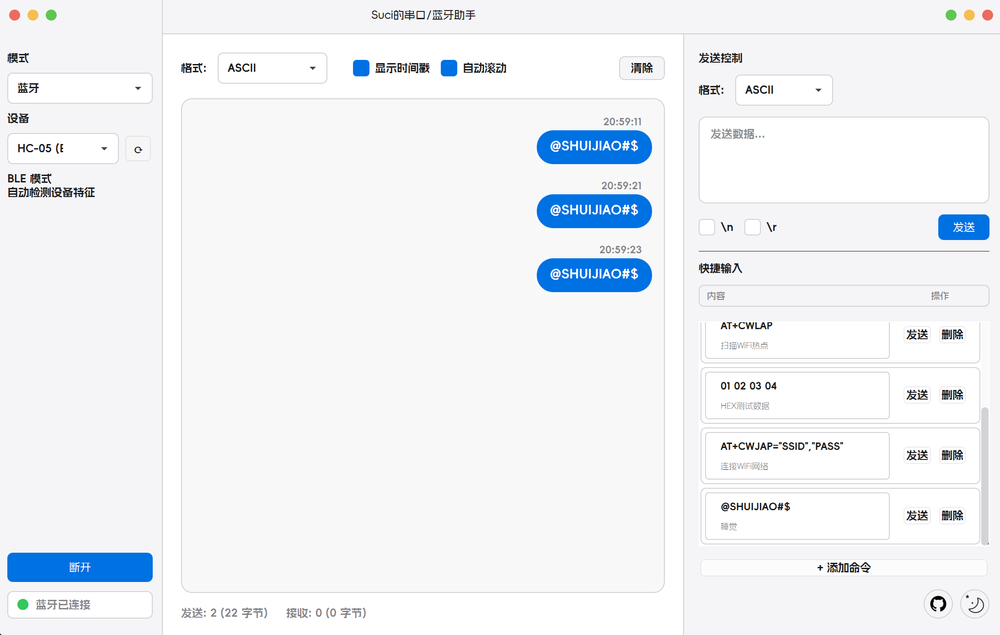

# Suci的串口/蓝牙助手

一个基于 PyQt6 的现代化串口/蓝牙调试工具，采用 macOS 原生风格设计。

## ✨ 特性

- 🎨 **macOS 风格界面** - 简洁优雅的用户界面设计
- 🔌 **串口通信** - 支持多种波特率、数据位、停止位、校验位配置
- 📡 **蓝牙通信** - 支持蓝牙设备扫描和连接
- 🔄 **模式切换** - 下拉框快速切换串口/蓝牙模式
- 📊 **多种数据格式** - 支持 HEX、ASCII、UTF-8 格式显示和发送
- 📈 **实时统计** - 实时显示发送和接收的数据统计
- ⚡ **高性能** - 基于异步事件循环，响应迅速
- 🌓 **黑夜模式** - 支持日间/黑夜模式切换
- ⚙️ **快捷命令** - 支持自定义快捷命令，快速发送常用指令

## 📸 截图



## 🚀 快速开始

### 环境要求

- Python 3.8+
- Windows / macOS / Linux

### 安装

**方法一：使用安装脚本（推荐）**

Windows:
```bash
install.bat
```

Linux/macOS:
```bash
chmod +x install.sh
./install.sh
```

**方法二：手动安装**

1. 安装基础依赖：
```bash
pip install PyQt6==6.6.1 pyserial==3.5 qasync==0.27.1
```

2. 安装蓝牙支持（可选）：

Windows（推荐 Bleak）：
```bash
pip install bleak
```

Linux/macOS（可选 PyBluez 或 Bleak）：
```bash
# PyBluez（经典蓝牙）
sudo apt-get install libbluetooth-dev  # 仅 Linux
pip install pybluez

# 或 Bleak（BLE 低功耗蓝牙）
pip install bleak
```

### 运行程序

```bash
python main.py
```

## 📖 使用说明

### 串口模式

1. 在左侧"模式"下拉框选择"串口"
2. 点击刷新按钮（⟳）刷新串口列表
3. 选择要连接的串口
4. 配置波特率、数据位、停止位、校验位
5. 点击"连接"按钮
6. 在右侧输入框输入数据，选择格式后点击"发送"

### 蓝牙模式

1. 在左侧"模式"下拉框选择"蓝牙"
2. 点击刷新按钮（⟳）扫描蓝牙设备
3. 选择要连接的蓝牙设备
4. 如果使用 PyBluez，设置 RFCOMM 端口号（通常为 1）
5. 点击"连接"按钮（会显示橙色连接动画）
6. 在右侧输入框输入数据，选择格式后点击"发送"

**蓝牙库说明：**
- **Bleak**: 适用于 BLE（低功耗蓝牙）设备，Windows 推荐
  - 默认使用 Nordic UART Service (NUS) UUID
  - 支持标准 BLE 串口服务的设备
- **PyBluez**: 适用于经典蓝牙设备（如 HC-05/HC-06 模块）

**BLE UUID 配置：**
程序默认使用 Nordic UART Service (NUS) 的标准 UUID：
- Service: `6E400001-B5A3-F393-E0A9-E50E24DCCA9E`
- RX (写入): `6E400002-B5A3-F393-E0A9-E50E24DCCA9E`
- TX (通知): `6E400003-B5A3-F393-E0A9-E50E24DCCA9E`

如果您的设备使用不同的 UUID，请修改 `src/core/bluetooth_manager.py` 中的 UUID 定义。

### 快捷命令

右侧边栏的"快捷输入"面板可以：
- 添加常用命令
- 编辑命令内容和描述
- 一键发送命令
- 删除不需要的命令
- 配置自动保存到 `quick_commands.json`

### 其他功能

- **黑夜模式**: 点击右下角的月亮图标切换
- **数据格式**: 支持 HEX、ASCII、UTF-8 三种格式
- **时间戳**: 可选显示接收数据的时间戳
- **自动滚动**: 自动滚动到最新数据
- **数据统计**: 底部实时显示发送/接收次数和字节数

## 🛠️ 项目结构

```
.
├── main.py                          # 主程序入口
├── requirements.txt                 # 依赖列表
├── install.bat / install.sh         # 安装脚本
├── quick_commands.json              # 快捷命令配置
├── src/
│   ├── core/                        # 核心功能模块
│   │   ├── app_config.py            # 应用配置
│   │   ├── serial_manager.py        # 串口管理
│   │   └── bluetooth_manager.py     # 蓝牙管理
│   ├── ui/                          # 用户界面
│   │   └── macos_ui.py              # macOS 风格界面
│   └── resource/                    # 资源文件
│       ├── Assistant.png            # 应用图标
│       ├── GitHub.png               # GitHub 图标
│       ├── dark.png                 # 黑夜模式图标
│       ├── triangle.png             # 下拉箭头图标
│       └── AlimamaFangYuanTiVF-Thin-2.ttf  # 字体文件
└── README.md
```

## 🔧 常见问题

### 串口无法连接
- 检查串口是否被其他程序占用
- 检查串口参数是否正确
- 尝试重新插拔设备

### 蓝牙功能不可用
- Windows: 安装 `pip install bleak`
- Linux/macOS: 安装 `pip install pybluez` 或 `pip install bleak`

### 蓝牙扫描不到设备
- 确保蓝牙设备已开启并处于可发现状态
- PyBluez 需要先在系统中配对设备
- Bleak 可以直接扫描 BLE 设备

### 蓝牙连接失败
- PyBluez: 确保设备已配对，尝试不同的 RFCOMM 端口号（1-30）
- Bleak: 确保设备支持 BLE 并处于可连接状态
- 检查设备是否被其他程序占用

### Linux 权限问题
```bash
sudo usermod -a -G dialout $USER    # 串口权限
sudo usermod -a -G bluetooth $USER  # 蓝牙权限
# 重新登录后生效
```

## 📦 依赖项

- **PyQt6** - GUI 框架
- **pyserial** - 串口通信
- **qasync** - 异步事件循环
- **bleak** - BLE 蓝牙通信（可选，Windows 推荐）
- **pybluez** - 经典蓝牙通信（可选，Linux/macOS）

## 🎨 界面特点

- 无边框窗口，自定义标题栏
- macOS 风格的红黄绿窗口控制按钮
- 圆角设计，所有组件采用圆角
- 支持窗口拖动和全屏切换
- 日间/黑夜模式切换
- 统一风格的提示对话框

## 🤝 贡献

欢迎提交 Issue 和 Pull Request！

## 📄 许可证

MIT License

## 👨‍💻 作者

Suci

---

⭐ 如果这个项目对你有帮助，请给个 Star！
